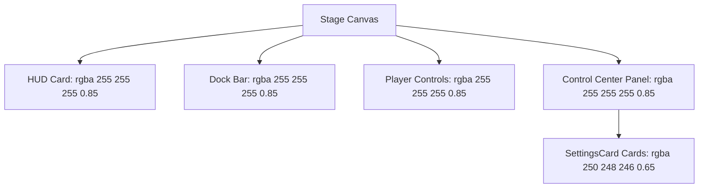

# Design Specification: Translucent Glassmorphic Peach UI Redesign

**Status**: Planning (Pending User Review)
**Topic**: UI Visual Redesign (Option B)

---

## 1. Visual Architecture

We will shift the application UI to a modern **Translucent Glassmorphic Peach** style. This design utilizes frosted-glass translucent container backgrounds, thin subtle peach strokes, and vivid peach gradients for active controls, maintaining readable charcoal text for high accessibility.

---

## 2. Style & Color Palettes

| Element / Color | Value | Description |
| :--- | :--- | :--- |
| **Primary Theme Accent (Peach)** | `#ff7e5f` | Header text, active sliders, buttons, density curve |
| **Secondary Peach Gradient** | `#feb47b` | Gradient pairs for particle system explosions and hover cues |
| **Card / Panel Backdrop** | `rgba(255, 255, 255, 0.85)` | Semi-translucent frosted glass effect |
| **SettingsCard Backdrop** | `rgba(250, 248, 246, 0.65)` | Inner card body background |
| **Subtle Card Stroke** | `rgba(255, 126, 95, 0.2)` | Thin border for all panels |
| **Contrast Text Label** | `#453c38` | Deep charcoal for all readable labels and settings values |

---

## 3. UI Component Breakdown

### 3.1 ControlCenter & SettingsCards
- **Backdrop**: Drawn with `rgba(255, 255, 255, 0.85)` background, bordered with `rgba(255, 126, 95, 0.15)`.
- **Cards**: Background fill is `rgba(250, 248, 246, 0.65)` with stroke `rgba(255, 126, 95, 0.2)`. Card header title color is `#ff7e5f`.
- **Contrast Checklist**: Checkbox labels (glow, gradient, rainbow, outline, physics, jelly) use `#453c38` text to guarantee 100% legibility on light background.
- **Dropdowns**: Styled using light translucent cream background `rgba(255, 255, 255, 0.9)` and charcoal text with a thin border `rgba(255, 126, 95, 0.25)`.
- **Sliders**: Track filled with light peach, active path filled with `#ff7e5f` (peach), thumb is white with a thin peach border.
- **Close Button `✕`**: Text color `#ff7e5f`.

### 3.2 Dock Bar
- **Container**: Rounded `rgba(255, 255, 255, 0.85)` backdrop with `rgba(255, 126, 95, 0.2)` stroke.
- **Input Field**: Replace the dark box with a light transparent field: background `rgba(250, 248, 246, 0.8)`, border `rgba(255, 126, 95, 0.15)`, and dark charcoal text.
- **Send Button**: Solid `#ff7e5f` (peach) fill with white text.
- **Menu Button `☰`**: Light peach background `rgba(255, 126, 95, 0.1)` with `#ff7e5f` text.

### 3.3 PlayerControls & Timeline Density Curve
- **Container**: Matching `rgba(255, 255, 255, 0.85)` backdrop.
- **Timeline Density Curve**: Drawn with a translucent peach gradient fill: `rgba(255, 126, 95, 0.3)`.
- **Play/Pause Button**: Background `rgba(255, 126, 95, 0.1)`, icon `#ff7e5f`.
- **Rate Dropdown**: Light peach/cream style.

### 3.4 HUD Panel
- **Container**: Translucent `rgba(255, 255, 255, 0.85)`.
- **Metrics**: Values like GC saved highlight in `#ff7e5f`. All labels are `#453c38`.

---

## 4. Verification & Testing
1. **TypeScript Compile**: Ensure `tsc && vite build` succeeds.
2. **Visual Audit**: Verify contrast of checkbox labels and clean borders under local debug browser.
3. **Unit Tests**: Retain all 47 green tests.
